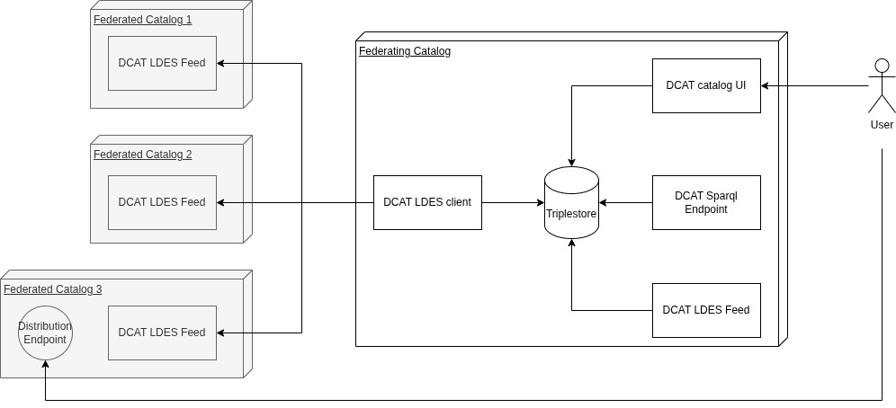

# DECIDe Federating Catalog

This app provides a Federated Catalog for a data space.  The members of a data space each publish meta data on the catalogues and data sets they have.  This app consumes that meta data and publishes a combined overview that users can search for data sets they are interested in.

This app relies on LDES to retrieve data from data space members.  Furthermore, data space members should use DCAT to describe their data set meta data.  The obtained meta data is combined and republished using LDES.  In addition a frontend is available oriented at human users as well as a SPARQL endpoint.




## What's included

This repository contains multiple docker-compose files

- _docker-compose.yml_ This provides you with the backend components.
- _docker-compose.dev.yml_ Provides changes for a good frontend development setup.
  - publishes the backend services on port 80 directly.
  - publishes the database instance on port 8890 so you can easily query this


## Running and maintaining

General information on running and maintaining an installation.


### Getting started

1. Clone the repository and go into the directory
2. To ease all typing for `docker compose` commands create a compose override file in the root of the project

```bash
touch docker-compose.override.yml
```

3. Create an `.env` file so we can define the compose files and other environment variables

```bash
touch .env
```

4. Set the `COMPOSE_FILE` in the `.env`

```bash
COMPOSE_FILE=docker-compose.yml:docker-compose.dev.yml:docker-compose.override.yml
```


### Running the stack
This should be your go-to way of starting the stack.

```bash
docker compose up -d # run without -d flag when you don't want to run it in the background
```


## LDES

This app obtains its data from multiple LDES feeds.  For each individual feed a separate LDES consumer is requirement.  To obtain data from the feeds, make sure to configure the `LDES_ENDPOINT_VIEW` for each feed in your `docker-compose.override.yml` file.
